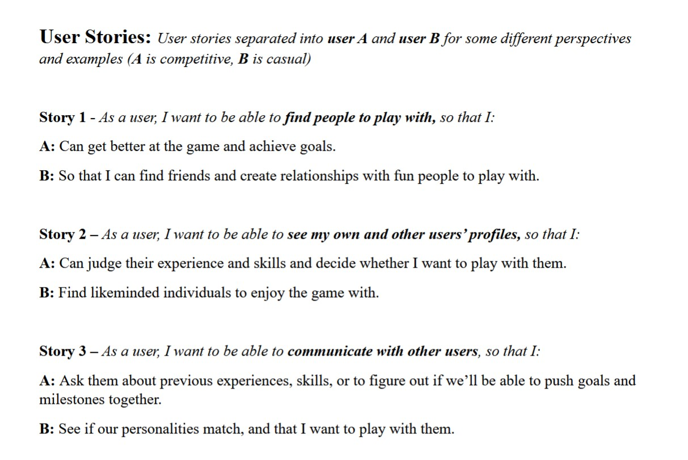
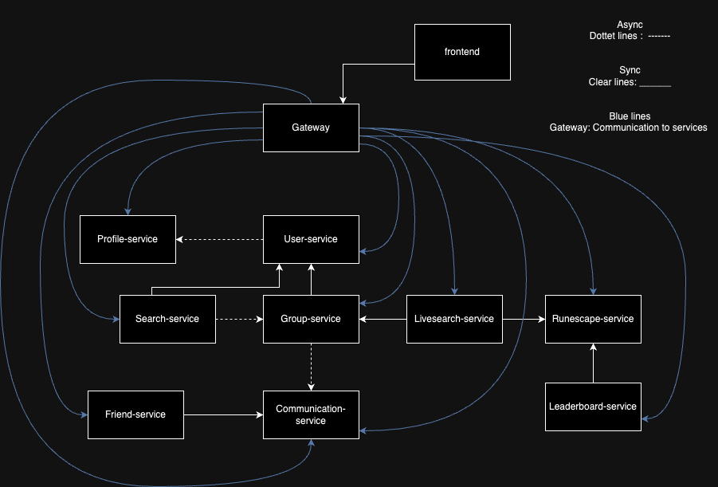

# PG3402 Microservices exam
## _PlayPal delivery group: 21320193_

## **__1. Introduction and Overview__**
**___PlayPal___** is a groundbreaking social group-finding application designed to bring gamers together from all around the world. Whether you're looking for teammates to tackle challenging in-game content, casual friends to share fun moments with, or competitive partners to climb the ranks, PlayPal offers the tools to connect you with the perfect match.

Our platform is tailored to fill a gap in the gaming industry: the lack of effective and inclusive group-finding systems. Many games either lack this functionality entirely or provide subpar solutions, leaving players to fend for themselves. With PlayPal, we aim to centralize group-finding across various gaming communities, starting with a focus on **__Old School RuneScape (OSRS)__** — a beloved MMORPG with millions of active players but no built-in group search or friend-finding system.

Through **PlayPal**, we aspire to create an engaging and user-friendly experience that allows gamers to:

* Find friends or teammates easily for cooperative gameplay.
* Use both live-searches for quick matching, or static posts for more controlled groups.
* Create and join events/groups tailored to in-game activities.
* Engage in real-time chat and community interactions.
* Participate/view leaderboards to encourage engagement.
* Most importantly, have fun! (And level up:👍)  

## **__2. How to Build, Start and Run the Project__**

---
#### **Steps to Build and Run:**
_Either use .zip file provided or clone the repo._

**1. Clone the repo.**  
Navigate to root project folder with cd command based on where project's located on computer system.
```
git clone https://github.com/MathiasTor/MicroServices.git
cd <project-directory>
```
Replace `<project-directory>` with the name of the folder created by cloning.

----

**2. Navigate to the root directory of each service and run:**
```
mvn clean install
```  

***Alternatively, you can use the provided script to build all services automatically:***  
(**_Ensure the script is executed from the root folder and that you're using a Bash-compatible terminal._**)
```
./build-services.sh
```
> [!IMPORTANT]
>  If "Permission denied" run: chmod u+x build-services.sh


### **__Option 1: Container/Docker build and run__**

**Prerequisites**  
PlayPal is fully containerized using Docker, ensuring that it can run seamlessly on any system with Docker installed. The only requirements for running the project are therefore:
- **Docker:** Ensure Docker is installed and running on your system.
Verify installation by running:

  **`docker --version`**

> [!NOTE]
> Since the services are containerized, they should work on any operating system that supports Docker (Linux, macOS, or Windows).

**Use the provided script to build all images automatically:**
(**_Ensure the script is executed from the root folder and that you're using a Bash-compatible terminal._**)
```
./build-docker.sh
```
> [!IMPORTANT]
>  If "Permission denied" run: chmod u+x build-services.sh
This can also be automated if you run the build-docker.sh bash script in root.

***Alternatively, you can set up manually:***  
Make sure docker engine is running, for example through docker desktop.  
To run these commands, make sure you're in root folder of the project.
- `docker build -t communication-service:1.0 ./playpal-communication-service`
- `docker build -t profile-service:1.0 ./playpal-profile-service`
- `docker build -t friend-service:1.0 ./playpal-friend-service`
- `docker build -t group-service:1.0 ./playpal-group-service`
- `docker build -t leaderboard-service:1.0 ./playpal-leaderboard-service`
- `docker build -t runescape-service:1.0 ./playpal-runescape-service`
- `docker build -t search-service:1.0 ./playpal-search-service`
- `docker build -t user-service:1.0 ./playpal-user-service`
- `docker build -t gateway:1.0 ./playpal-gateway`
- `docker build -t frontend:1.0 ./playpal-frontend`
- `docker build -t livesearch-service2:1.0 ./playpal-livesearch-service2`

**Running the containers:**  
Navigate to docker directory and run docker compose file.

```
cd docker
docker-compose up --build
```

This will run all the docker containers and images according to the configurations.

When this is done, you can access the frontend on `localhost:3000`, and the backend services on their respective ports (addressed at the end of this section).

----

Due to the nature of our system, combined with the size, we've created an extensive frontend for testing purposes. Please utilize it as much as possible to test required functionality, and endpoints.

### **__Option 2: Local Setup (without docker)__**
Follow these steps to build and run the project without Docker.  
This will require some tools installed on your system.  
**Prerequisites:**
- **Java 21**
- **Maven:** Required to build the services locally (if testing without Docker).
- **RabbitMQ:** For asynchronous communication and messaging if used locally.
- **Postman** (_optional_): For testing API endpoints directly.
- **Consul**: Centralized configuration management and service discovery tool.
- **Frontend**: For displaying the frontend, node.js must be installed on the computer. Verify installation by running:  
  **`node --version`**


**4. Run the services:**  
Navigate to each service directory and run the service using Maven.
```
cd your-service-directory
mvn spring-boot:run
```

Run commands to start RabbitMq (or use app RabbitMQ service - start. You can also use sudo.)
```
rabbitmq-server
```
Run commands to start Consul in its own terminal.
```
consul agent -dev -node playpal-local-dev-node
```

**5. Run the frontend:**  
Navigate to playpal-frontend and run.
```
cd playpal-frontend
npm i
npm start
```
### **Ports and logins**
- **Frontend:** `3000`
- **Search Service:** `9091`
- **Runescape Service:** `9002`
- **User Service:** `9070`
- **Profile Service:** `8087`
- **Live Search Service:** `9040`
- **Leaderboard Service:** `9010`
- **Group Service:** `8090`
- **Friend Service:** `9020`
- **Communication Service:** `8085`
- **RabbitMQ:** `5672` _username:_ guest, _password:_ guest
- **Gateway:** `8080`
- **Consul:** `8500`
- **Dozzle centrallized logging:** `9090`
- **H2 login:** _username:_ sa (jdbc url defined in each service application.properties )

**Post-Setup Verification:**

Check localhost:8500 to see if consul is running, and if all services are green. This means the health checks are "UP", and therefore running.

You can also check Dozzle centrallized logging to check the active running services and their logs.
(localhost:9090)
Dozzle also has a mode called "swarm-mode". **Make sure to enable this**.  
With this we have created labels that group different parts of our project/services to centralize the logging.


## **__3. User Stories and Functionality__**
Image of user stories from Arbeidskrav:



- [x]  **Story 1: As a user, I want to find people to play with.**
- [x]  **Story 2: As a user, I want to be able to see ones own and other people's profiles.**
- [x]  **Story 3: As a user, I want to be able to communicate with other users.**


**_Implementation Details:_**

**Story 1:** Find People to Play With


Users can search for active users and befriend them, search live for other players, or browse/create static group posts.

*Services Involved:*

- Search Service: Handles search logic and matchmaking.
- Live-search Service: Handles live matchmaking with algorithm for matching.
- Runescape Service: Fetches runescape stats for matching algorithm, and profile showcasing.
- User Service: Handles registration and login.
- Profile service: Creation of profiles, which allows for interaction.
- Group Service: Creates groups with applicants or people found through live search.
- Frontend to show all the functionality.

**Story 2:** View User Profiles

Users can view profiles. With this they can look at their RuneScape stats if they're linked to assess their skills and experience. 
Upvoting and downvoting system in case someone makes for a bad experience, or vice versa. AI generated images.

*Services Involved:*
- Same services as user story 1.
- Additionally, Runescape Service for fetching runescape stats and showcasing them.

**Story 3:** Communicate with other users.

Users can communicate with other users through chat and messages.
Full functionality for chatting with other users with websockets through gateway.  
Chats generated automatically through communication service, based on what happens. 
For example, Live Search generated group creates a conversation between those two, 
while accepting group with multiple users makes conversation for those users.  

*Services Involved:*
- Same services as user story 1 and 2.
- Communication Service: Handles real-time chatting and messaging with websockets.

_All of our initial user stories are implemented with full functionality._
We've also expanded upon our initial user stories to include more functionality.  
This includes: 
- Being able to link your profile to an external RuneScape api, and then showcase the stats with updates.
- Generate AI image for your profile.
- Upvote and downvote system for profiles.
- Leaderboard showcasing both overall kills, and a weekly updated leaderboard.
- Live search functionality for matching with other users with an algorithm on RuneScape stats.


_This was to reach the full potential of our project and desired/best case scenarios, and to showcase the full functionality of our services.  
With this added functionality we also get to address the original user stories, in a more interesting way._

### **Additional "user story" test, with full workflow suggestion:**

_To test all the microservices' functionality , we suggest the following workflow:_  

"**Story 4:** As a user I want to use a runescape group-finder application to find people to play with."

> [!NOTE]
> In general, the frontend should be quite intuitive, so try to click around and use the functionality, on correct different browser-users.
However, below we have a full workflow explaining steps to test functionality detailed. Hopefully it is helpful.


> [!WARNING]
> **_This application is meant to be used across different systems. If you test locally, there might be some
interfering issues with cookies. It's therefore very important to make sure that your cookies are individual for each user on page refresh,
to be able to test the functionality._**  
> **_We recommend to open a browser, and an incognito tab of that same browser, and a separate third browser. Or three separate browsers.
Afterward, create the users, and confirm that your profile page/cookie ID remains the same as the correct user you logged in as._**

The first thing you have to do is to register multiple users. Here are some example users you can use:
```
username: bob
email: bob@123.no
password:123
```
```
username: kari
email: kari@123.no
password:123
```

```
username: per
email: per@123.no
password:123
```


Then login to these users on their respective browsers.  
On the home page, choose RuneScape game. Then proceed to create a post. Give it a title, a description and tag.

Here is an example of a post you can use:
```
Title: Cutting Willowtrees
Description: Looking for someone to cut willow trees with me. I have a rune axe.
Tags: woodcutting, willow, axe
```
Press submit, and view your own post. Go on another browser/user, click home page, and enter RuneScape.  
You should now see the post you created. Apply to the group. Go back to the user that created the post, and refresh (no websockets on this page, only communication).
There should be an applicant. Approve it.  
You now have a state of a group, but it hasn't been created yet. To create the group (when you're happy with the amount of users), Stop the Search for participants.
The group will now be created, and you can see it under the group tab. You can also chat with the group under the group location under group tab.

You can also then add users to this existing group, in the "Add people by Username" field. Add your last user to this group, and check the group tab.
You can also statically create your own group, and invite to it under the group tab. 

If you enter the home page, you should be able to click the profile of another user under "approved users". Do this to enter his profile (not yours).
This should bring you to a URL with the user's ID profile. Here you can see his stats when you're linked with runescape (we will do this later), and you can upvote / downvote.
You can confirm that the upvotes work by entering another browser/user to see if it updated.

In the bottom right, you can add friends, and access direct message chats. Test these buttons with the user's names.  
Generate a chat, add some friends, block, etc. If frontend doesn't update, remember to refresh. 

```
Example: Kari, clicks friends, then "+". Writes bob, and add friend. Enter bob browser, accept.
 Chat is generated(under chat tab) and you can interact.
```
Proceed to your own Profile, by clicking the Profile tab. This is different from when you enter other user's profile, as you can "link runescape account",  
and "Edit Profile".  
Try to Edit Profile, update your bio, and generate an AI picture. When generating an AI picture, it will say "Loading..." for a bit, but then eventually update.
After doing this. Link your account to a RuneScape account.  

**This is important for testing LiveSearch functionality and leaderboard. We therefore recommend you to use the following RuneScape Usernames:**  

_Link each browser's user to a unique RuneScape account._
```
User 1: (bob from our example)
RuneScape Username to Link with: woox

User 2: (kari from our example)
RuneScape Username to Link with: a cold one

User 3: (per from our example)
RuneScape Username to Link with: erntt
```
Now that you've linked the profiles. You can go to the leaderboard tab, and see the leaderboard. If it hasn't updated yet, wait for the 30-second update timer. 
This displays the overall kills of each user, and also has a weekly leaderboard, that updates monday 12 o'clock every week, to see who won the most kills that week.

_As you just started, the weekly leaderboard doesn't have any kills, but we attached some images of functioning weekly leaderboard._

if you click the profiles of other users again, from the home page, you should now see their runescape stats and kills on their profile.

Lastly, we have a live-search algorithm using the collected kill counts of the RuneScape accounts, to match the players based on their skill level/play amount. 
It will match you with the closest user to your own kill count. The kill count treshold will decrease the longer you're in queue, to a max percentage of 50% of the total amount of the user's kill count.
Because of this, to match two users, you need to be sure that the users you go live with are within each other's 50% range. 

For testing purposes, it will decrease the treshold every 5 seconds, to reach 50% after 25 seconds. In real use it would be higher with more users.

Therefore, to test this functionality, go live on user 2(kari from our example, or the user linked with the highest score "a cold one").  
Then go live on user 1(bob from our example, or the user linked with the middle score "woox").  
Since these user's are too far apart, no match will be found.
Proceed to go live on user 3(per from our example, or the user linked with the lowest score "erntt").  
You should now match with the fitting other player, a group should be created, and a conversation should be created.

If you have any issues, remember to refresh the page, as the frontend doesn't always update as only communication service has websockets through the gateway.
```
Relevant Endpoints: Link to section on some endpoints: [Link Text](#Relevant-Endpoints).
```

## **__4. Project Architecture__**



**Architecture overview:**

The architecture of PlayPal is based on a microservices approach, with each service handling a specific concern. Following the SRP (Single Responsibility Principle).

Our **frontend** is a separate service, which communicates sync with the backend services through the Gateway Service. 
The **Gateway Service** routes and handles incoming requests to the correct microservices and distributes load evenly. It technically communicates synchronously with all the other services, but it is the only service that communicates with the frontend routing through it.
Our **User Service** handles core user data, such as registration and login. This service communicate asynchronously with the **Profile Service** via rabbitMQ messages to create profiles. 
When you register a user, a message is published, and listened to from **Profile Service** to create a profile.
We then have the **Search Service**, that handles searching for other users to play with. This service handles creation of posts. and does synchronous communication with the **User Service** to get the usernames.  
Whenever a post is created, applied to, and then ended - a rabbitMQ message is published, and listened to by the **Group Service** to create a group.  
The **Group Service** handles group creation automatically, and when it creates a group, it publishes another async message that is communicating with communication service. This flow ensures that no data is lost, and a post is created, and then a group is created, and then a chat is created.  
**Group Service** also communicates synchronously with the **User Service** to get the usernames of the users in the group.
The **Live Search Service** handles live search functionality, and matches users based on their RuneScape stats. This service communicates synchronously with the **Runescape Service**, and the **Group Service** to get the stats, and to create the group when matched.  
The **RuneScape Service** handles fetching of RuneScape stats for other services.  
The **Leaderboard Service** communicates with the **RuneScape Service** with synchronous communication to get the stats, and then creates a leaderboard based on the stats.
Gateway Service Details:

Explain how the gateway routes external calls.
    Mention load balancing if implemented.

Configuration and Health Checks:

Show how Consul is used to manage configuration centrally.
    Explain how to access health check endpoints (e.g., http://localhost:<service-port>/actuator/health).
    Show a sample healthy response ({"status":"UP"}).

## **__5. Reflections on Architecture Choices__**

We set up our communication patterns to be both synchronous and asynchronous following the Microservices Principles. We also made sure to 
separate concerns, and to have a clear structure of our services. In the services where dataloss could be a problem, we made sure to use RabbitMQ to ensure that no data was lost.
As an example, a post is created, and then a group is created, and then a chat is created. This is to ensure that no data is lost, and that the flow is correct. 
There is no purpose of the post, if no group is created.


We made changes to our architecture from the initial proposal in the arbeidskrav.  
As our project grew, we realized that a more separated approach would be beneficial.  
We also realized that we had to separate concerns out further, as well as focus on key services, rather than some unecessary front-end ones.

This resulted in more services, and a more complex architecture, with some changes, but also a more scalable, maintainable and functional one.

One of the key changes was to not create a separate service for the storage, but rather let each individual service have their own database.
This was to ensure that each service could be more independent, and that we could scale them individually if needed.  
It also means that services can do what they are intended to do, even if other service's databases are down.

We also decided to remove notification service, as the focus of this exam was not on frontend. As we already had quite a big frontend, 
we decided to focus on the backend services, and the communication between them.

We also renamed some of the services to better reflect their functionality, and to make it easier to understand what they do.

Due to the changes in architecture, we also had to change the sync/async communication between services. This is reflected in our new architecture diagram.

**CHANGES FROM ARBEIDSKRAV**

**Meeting Project Guidelines**
Below is a summary of how PlayPal meets each of the microservice-specific and architectural requirements outlined in the exam:

- Multiple Microservices and clear structure/functionality:
    The system includes multiple services that have separate functionality, clear structure, and communicate with each other.  
User, Profile, Live-Search, Communication, Group, and more. Each has a specific responsibility, adhering to Single-Responsibility Principles and SOLID.

- Synchronous Communication:
    The system includes a lot of synchronous communication as shown in the architecture. 
The User Service calls the Profile Service via REST to retrieve user details.

- Asynchronous Communication:
    The system includes asynchronous communication with RabbitMQ as shown in the architecture. 
For example, search post creation events are published to RabbitMQ, consumed by the Group Service to create groups, then sent to the Communication Service to create chat rooms.

- Consistent Architecture and Documentation:
    Our architecture diagram in Section 4 illustrates all services and their communication patterns. The README details each service’s role and how they connect.

- Single Entry Point & Load Balancing:
    The Gateway Service routes incoming requests to the correct microservices and distributes load evenly.

- Centralized Health Monitoring and configuration:
    Spring Boot Actuator health endpoints (/actuator/health) provide a simple means to check each service’s status.
 Consul manages service configurations. Consul also checks whether a service is "status":"UP", through our actuator health points (f.example. localhost:8080/group/actuator/health)
    
- Containerization:
    All services are containerized with Docker, and are running and interacting with each other. Build and run instructions are detailed in Section 2.

## **__7. Contributions__**

Our team collaborated effectively to develop PlayPal, with each member contributing to most aspects of the project. 
Considering this is a group project, we've all contributed to the project in various ways.
Throughout the semester, we worked together to design the architecture, implement services, and ensure seamless communication between components.

We knew from previous experience that working physically works well for us, and we therefore made the decision to do so for this project as well.  
As a natural result of this, we pair programmed a lot, and helped each other out with different tasks and services when needed.
There was also tasks related to architecture, theory application, design and documentation that was divided between us. 
However, the flow was quite natural, and whoever finished a task, would then proceed to do a "Highest Priority" task that was necessary to complete.
If someone struggled with a functionality, or had a question, we would help each other out by either swapping the
responsibility, or by pair programming to solve the issue together. 

When it comes to individual contributions, we had an initial responsibility assigned to each member, even though the tasks were not strictly divided, and we all worked on all services.
This was mostly to get some services up and running, and to have a starting point for each member. Not to decide that this service was yours alone to work on.

**We all worked on all services, and all services were touched by all members.**  
_Here's a breakdown of our contributions (based on initial responsibilities, but not sole responsibilities):_
- **Robin:** 
  - **Responsibility:** Group Service, Leaderboard service.
  - **Contributions:** Initial creation and work with Group Service, and leaderboard service. Worked on group creation, leaderboards.  
Worked on rabbitMQ and event driven.
  - Helped everyone else with their services/tasks.
- **Mathias:**
  - **Responsibility:** Frontend, RuneScape Service, Friend Service, general overview.
  - **Contributions:** Implemented most of the necessary frontend for our application. Worked on Runescape service and friend service, and also adjusted services as needed for correct system flow/architecture.
Due to having control of frontend, had a good overview of everyone else's work / services.
  - Helped everyone else with their services/tasks.
- **Borse:**
  - **Responsibility:** Search Service, Communication Service, Websocket, Live Search Service, Documentation/Theory.
  - **Contributions:** Implemented Search Service, Communication Service and Live Search service. Added initial websocket config for chats/messages. Worked on rabbitMQ and event driven.
  - Helped everyone else with their services/tasks. 
- **Ernad:**
  - **Responsibility:** Profile Service, Friend Service, Logging.
  - **Contributions:** Implemented user and profile service. Assisted Maiwand on docker setup and config. Centralized logging with docker.
  - Helped everyone else with their services/tasks.
- **Maiwand:**
  - **Responsibility:** Docker, Cleanup, General assisting others.
  - **Contributions:** Implemented Docker and containerization. Helped with cleanup and general assistance.
  - Helped everyone else with their services/tasks.


## **__8. Relevant-Endpoints__**
If you would like to test some functionality through Postman instead of our frontend, we have listed some relevant endpoints below.


- **User Service:**
    - **POST /user/api/users/:** Register a new user.
   
- **Profile Service:**
   
- **Search Service:**
   
- **Group Service:**
   
- **Live Search Service:**
   
- **RuneScape Service:**
- **Leaderboard Service:**
   
- **Communication Service:**
   
- **Friend Service:**
   
- **Gateway Service:**
    - **All endpoints:** Routes incoming requests to the correct microservices.
- **Frontend:**
    - **All endpoints:** Routes to the correct service endpoints.
- **Consul:**
```


Join us as we redefine how gamers connect and play together. Welcome to PlayPal, where your next adventure begins.